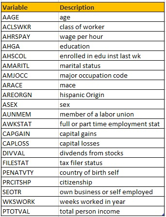

```{r setup, include=FALSE}
knitr::opts_chunk$set(echo = TRUE)
knitr::opts_chunk$set(message = FALSE)
knitr::opts_chunk$set(warning = FALSE)
```

# Introduction

**The Problem statement**

Classification is a supervised machine learning algorithm of assigning a class label based on known examples. There are many different types of classification tasks requiring machine learning approaches such as those to be discussed below. In this document, we will try to predict a person's income based on census data.

The predictions will be either above 50K or below 50K. Since the dependent variable is of a categorical type, we have a classification problem at hand. 

While there are numerous techniques of classification, we will apply the following three and compare the results:

**1. Logistic regression**

logistic regression is a regression with a qualitative dependent variable. The regression models the probability that the qualitative dependent variable will take a specific value. It uses a link function to link the regression over variables to natural probability range, [0,1].


**2. Naive Bayes**

Naive bayes is a supervised learning model used in classification that is based on assumption that all features of a class are independent of each other. This model is mainly used for problems with multiple classes and used in text classification.

**3. Random Forest**

Random forest is a supervised learning algorithm/model that uses a large number of ensembled decision trees on data samples. Each tree in the forest makes a prediction and the best solution is selected based on voting. This model is common for its simplicity and diversity hence, the combination of the multiple decision trees is likely to get a more accurate and stable prediction.

**Data source**

The source data comes from Census-Income (KDD) Data Set available [Here](https://archive.ics.uci.edu/ml/datasets/Census-Income+%28KDD%29)
The data set is divided into a train and test sets, each with 22 columns, some of which are categorical.



# Exploratory data analysis
Before we get to the modeling itself, we will analyse the data at hand. 

## Data preparation
Installing the necessary packages 
```{r}

requiredPackages = c("e1071","randomForest","janitor","verification","olsrr","DescTools","caret","tibble","purrr","corrplot","corrplot","dbplyr","dplyr","readr", "ggplot2", "glmnet","class","kernlab","verification")

for(i in requiredPackages){if(!require(i,character.only = TRUE)) install.packages(i)}
for(i in requiredPackages){if(!require(i,character.only = TRUE)) library(i,character.only = TRUE)}

```  

```{r, echo=FALSE}
setwd("~/sem 2/Machine Learning 1/project/classification")
```

Load the data
```{r}

data_census <- read.csv("CensusData_Train.csv")
```

Data summary
```{r}
summary(data_census)
```

Let's check our target variable,*PTOTVAL*
```{r}
summary(data_census$PTOTVAL)

```

*PTOTVAL* is a ordinal catogorical variable with two levels (-50000,50000+). 

```{r}
# is.factor(data_census$PTOTVAL)
data_census$PTOTVAL <- factor(data_census$PTOTVAL,
                           levels = c(" 50000+.","-50000"), #levels
                           ordered = TRUE) # ordinal

levels(data_census$PTOTVAL)
table(data_census$PTOTVAL)
```

## Missing values and outliers
Let's find if any entries are missing

```{r}

sum(is.na(data_census))
sapply(data_census, function(x) sum(is.na(x)))
```
> This is not quite true, becasue we know the missing values were represented by a question mark. 

Let's check by variable. 

```{r}
sapply(data_census, function(x) sum(x==" ?"))
```

Variable *PENATVTY* has missing values. 
We will will remove those observations. 

```{r}
data_census <- data_census[!data_census$PENATVTY == " ?",]

```

**Categorical and numeric variables**

a. Categorical variables
```{r}

categorical_vars <- 
  sapply(data_census, is.character) %>% 
  which() %>% 
  names()

categorical_vars

```

Let's change all categorical variables into factors. 
```{r}
data_census[categorical_vars] <- lapply(data_census[categorical_vars],factor)
```

Now we can check the list of levels for each variable.The output is hidden since too long. 
```{r, results = FALSE}
lapply(data_census[categorical_vars],levels)
```

Setting contrast
```{r}
options(contrasts = c("contr.treatment",  # for non-ordinal factors
                      "contr.treatment")) # for ordinal factors
```

a. Numeric variables
```{r}

numeric_vars <- 
  sapply(data_census, is.numeric) %>% 
  which() %>% 
  names()

numeric_vars

```

# Classification methods
In this stage, we will apply the 3 classification techniques discussed in the introduction. Before that, however, we will need to select from the variables.

## Variable selection
Before applying the classification techniques, we will once again go through the variables and select only those that will positively contribute to our model accuracy. Large size of variables can be beneficial to find the true causality relationship, however, it may make the calculations very expensive or sometimes overfitting may happen. 

## Selecting from numeric variables
Generally, it is advisable to remove variables with a *single level (zero variance)*, variables which are *linear combinations* of each other and variables with *very large correlation* with others. Let's do that one by one.

**1. Removing variables with 1 level**

```{r}

sapply(data_census[, numeric_vars], 
        function(x) 
          unique(x) %>% 
          length()) %>% 
  sort()
```

> No variables with 1 level. 

**2. Removing highly correlated variables**

If we have two highly correlated variables, we remove one from the model. Because they supply redundant information, removing one of the correlated factors usually doesn't drastically reduce the R-squared.
```{r}

correlations <- cor(data_census[, numeric_vars],
    use = "pairwise.complete.obs")


```

Plotting the correlations
```{r}
# using the 30 most correlated variables
corrplot.mixed(correlations,
               upper = "number",
               lower = "circle",
               tl.col = "black",
               tl.pos = "lt")

```

> We see that there are variables *WKSWORK* ( weeks worked in a year) and *AHRSPAY* (wage per hour) have the highest correlation.  We can remove one of them, however, since the correlation is only 75%, we keep both of them 

3. Removing linear combinations

```{r}

( findLinearCombos(data_census[,numeric_vars] ) ->
    linearCombos )
```

> No linear combinations. 

## Selecting from categorical variables
We can use general regression model to apply logistic regression. Then we will compare the p - values. 

We will need to prepare the dependent variable for this.  
```{r}
data_census$PTOTVAL <- ifelse(data_census$PTOTVAL=="-50000",0,1)
categorical_vars_all <- c(categorical_vars,"PTOTVAL") # add the dependent variable to the catergorical variables list. 

```

```{r}

model <- lm(PTOTVAL ~ ., 
                 data = data_census[categorical_vars_all])

# summary(model)

```
> Each level of a categorical variable is treated as  a separate variable. However, all variables are removed together if insignificant. 

**Automated elimination**

Backward elimination is general to specific approaching, where the model starts with all available variables, and then runs the model again and again, in each step removing 1 least significant variable. The process stops when a model with all variables significant is achieved. Other automated options are step-wise elimination and forward elimination. 

```{r,cache=TRUE}

ols_step_backward_p(model,
                    prem = 0.05,
                    # show progress
                    progress = FALSE) -> backward_selector

```

List of removed variables. 
```{r}

backward_selector$removed
```

> Variables *PRCITSHP*, *AREORGN*,*ARACE* are selected for removal. 

The remaining categorical variables

```{r}
categorical_vars_all <- categorical_vars_all[!categorical_vars_all %in% backward_selector$removed]

```

Let's combine the selected variables. 
```{r}
selectedvars <- c(categorical_vars_all ,numeric_vars)
```

Now that we have selected the variables, we can modeling. 

## Logistic Regression

a. logit model
```{r,cache = TRUE}
model_logit <- glm(PTOTVAL ~ ., 
                    family =  binomial(link = "logit"),
                    data = data_census[selectedvars])

```

a. probit model
```{r,cache = TRUE}
model_probit <- glm(PTOTVAL ~ ., 
                    family =  binomial(link = "probit"),
                    data = data_census[selectedvars])
```


## Naive Bayes

The function trainControl generates parameters that further control how models are created, with possible values. 

```{r}
model_nb = naiveBayes(as.factor(PTOTVAL) ~ .,
        data = data_census[selectedvars])
```

## Random Forest

```{r, echo=FALSE}
data_train <-data_census[selectedvars][1:1000,]
```

```{r,cache = TRUE}

model_rf = randomForest(PTOTVAL~., data_train, ntree=100, proximity=T)

```

# Prediction on test data
Now we will bring on the test data and test each of the trained models on the test data. The prediction results will be compared to the actual data and also to the results of other models. 

Let's load the data. 
```{r}
data_test <- read.csv("CensusData_Test.csv")
```


## Preparing the test data
We have to apply all the changes we made to the train data to the test data too. 

1. Remove rows with question mark for variable **
```{r}
data_test <- data_test[!data_test$PENATVTY == " ?",]

```

2. Change all categorical variables to factors.
```{r}
data_test[categorical_vars] <- lapply(data_test[categorical_vars],factor)

```

3. Change the dependent variable to binary levels (0,1)
```{r}
data_test$PTOTVAL <- ifelse(data_test$PTOTVAL=="-50000",0,1)
```

## Prediction

**Logistic Regression**

a.logit
```{r}
predict_logit <- predict(model_logit,data_test[selectedvars],
                          type = "response")
```

b.probit
```{r}
predict_probit <- predict(model_probit,data_test[selectedvars],
                          type = "response")
```


**Naive Bayes**

```{r}
predict_nb <- predict(model_nb,data_test[selectedvars],
                          type = "raw")
predict_nb <- predict_nb[,2]
```

**Random Forest**

Let's first get the train and test data to have the same class. 
```{r}
xtest <- rbind(data_census[1, ] , data_test)
xtest <- xtest[-1,]
```


```{r}
predict_rf <- predict(model_rf,xtest,
                       type = "response")
```


# Evaluation of model accuracy

The following function from lecture materials decodes the predicted probability values to binary levels,(0,1), and then calculates the model accuracy statistics from the confusion matrix it creates. 

```{r}
summary_binary <- function(predicted_probs,
                           real,
                           cutoff = 0.5,
                           level_positive = "1",
                           level_negative = "0") {

  ctable <- confusionMatrix(as.factor(ifelse(predicted_probs > cutoff, 
                                             level_positive, 
                                             level_negative)), 
                            real, 
                            level_positive) 

  stats <- round(c(ctable$overall[1],
                   ctable$byClass[c(1:4, 7, 11)]),5)
  return(stats)
}
```

We analyse the predictions using the function above. Let's first put the predictions all into dataframe. 

```{r}

predictions <- data.frame(logit = predict_logit,probit = predict_probit,
                             nb = predict_nb,rf = predict_rf)

```

The *summary_binary()* requires real values in factor format for *confusionMatrix* calculation. The following code chunk does that. 
```{r}
data_test$PTOTVAL <- factor(data_test$PTOTVAL)
```

Here we call the *summary_binary()* function for every pair of prediction and real value. The results will be compiled into a single dataframe for easier comparison.

```{r}

stats_logit <- summary_binary(predictions$logit,data_test$PTOTVAL) #1. logit
stats_probit <- summary_binary(predictions$probit,data_test$PTOTVAL) #2. probit
stats_nb <- summary_binary(predictions$nb,data_test$PTOTVAL) #3. KNN
stats_rf <- summary_binary(predictions$rf,data_test$PTOTVAL) #4. SVM
```

To compare the results in a table,  
```{r}
metrics <- rbind(stats_logit,stats_probit,stats_nb,stats_rf)
row.names(metrics) <- c("Logit","Probit","Naive Bayes","Random Forest")
metrics
```

## Comparison using ROC curve {.tabset}
An ROC curve plots TPR vs. FPR at different classification thresholds. The area under ROC curve,AUC,can be interpreted as the probability that the model ranks a random positive example more highly than a random negative example. The larger AUC values indicate better models. 

### Logit
```{r}

data_test$PTOTVAL <- ifelse(data_test$PTOTVAL=="0",0,1)
roc.plot(data_test$PTOTVAL,
         predictions$logit)

```

Area under ROC
```{r}
roc.area(data_test$PTOTVAL,
         predictions$logit)$A

```

### Probit
```{r}

roc.plot(data_test$PTOTVAL,
         predictions$probit)

```

Area under ROC
```{r}
roc.area(data_test$PTOTVAL,
         predictions$probit)$A

```


### Naive Bayes
```{r}

roc.plot(data_test$PTOTVAL,
         predictions$nb)

```

Area under ROC
```{r}
roc.area(data_test$PTOTVAL,
         predictions$nb)$A

```

### Random Forest
```{r}

roc.plot(data_test$PTOTVAL,
         predictions$rf)

```

Area under ROC
```{r}
roc.area(data_test$PTOTVAL,
         predictions$rf)$A
```

# Conclusion

After training and running 3 different classification models,  we can depict from the metrics that the Random Forest model has the highest accuracy rate at 94% with the rest at an average of 84%. Naive Bayes however, has the lowest ranking accuracy rate at 83% but is the fastest running model amongst the 3 classifying models used.

Logistic regression models (logit and probit) perform the worst, however, they run fast. The random forest algorithm achieves the highest classification accuracy, but takes the longest time and memory space. Naive Bayes, therefore works the best for this dataset. 

# References
1. https://machinelearningmastery.com/types-of-classification-in-machine-learning/

2. Lecture material